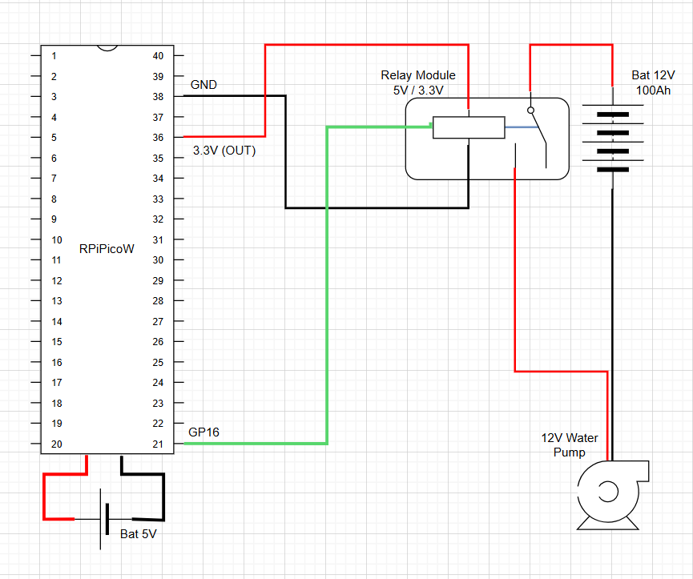

# 🌿 Rega na Varanda — Raspberry Pi Pico W

Este é um sistema de **rega automática** controlado por uma **Raspberry Pi Pico W**, que ativa uma bomba de água de 12V nos horários programados. Ideal para quem quer automatizar a rega de vasos ou pequenas hortas em varandas ou jardins.

---

## 📷 Esquema da Solução


> Diagrama ilustrativo: O Raspberry Pi Pico W controla um relé ligado à bomba de 12V, alimentada por uma bateria de 12V. O GPIO 16 envia o sinal para controlo do relé que aciona a bomba de água para regar as plantas.



> Esquema ilustrativo das ligações elétricas.

---

## 🛠 Componentes Utilizados

- Raspberry Pi Pico W  
- Módulo relé 1 canal (compatível com 3.3V)  
- Bomba de água 12V  
- Bateria de 12V (ou fonte de alimentação)  
- Resistores de proteção (opcional)  
- Cabos Dupont e protoboard (ou solda)  
- Conexão Wi-Fi com internet  

---

## ⚙️ Funcionalidades do Script

- Conexão à rede Wi-Fi com IP estático  
- Sincronização horária via NTP  
- Ativação da bomba de água em horários programados  
- LED da Pico W indica estado de atividade  
- Lógica de segurança: bomba desativa-se automaticamente fora dos horários  

---

## 🕒 Horários Programados

Os horários para rega são definidos como pares de hora e minuto no código:

```python
scheduled_times = [
    (8, 15),
    (11, 45),
    (14, 15),
    (17, 30),
    (18, 45),
    (19, 15),
    (20, 30)
]

## 🕒 Horários de Rega

A bomba ativa automaticamente nos seguintes horários (hora:minuto):

```
08:15, 11:45, 14:15, 17:30, 18:45, 19:15, 20:30
```

A duração de rega é de **15 segundos** por ciclo.
Ajustar a duração para obter a quantidade de água certa para cada ciclo.

## 💾 Como Usar

1. Liga os componentes conforme o diagrama acima, atenção à alimentação do RPi, deve ser de 5V.
2. Altera as variáveis `ssid`, `password`, `static_ip` e horários, se necessário e gravar com o nome "main.py".
3. Carrega o código para o Raspberry Pi Pico W.
4. Garante que o servidor NTP está acessível (usa-se IP fixo para maior estabilidade).
5. Alimenta o circuito (por USB e 12V para a bomba).

## ⚠️ Notas de Segurança

- Certifica-te que a bomba e o relé suportam a corrente necessária.
- Usa uma fonte de 12V confiável para alimentar a bomba.
- Nunca toques nos fios expostos com o sistema energizado.
- Protege o sistema contra humidade (caixa IP65 recomendada).

```

## 📷 Esquema da Solução Futura (Upgrade)


> Esquema ilustrativo das ligações elétricas: A solução vai ter um upgrade introduzindo, um sensor de humidade do solo nos vasos e um sensor de nivel de água no reservatório.
> 
> O Raspberry Pi Pico W controla um relé ligado à bomba de 12V, alimentada por uma bateria de 12V. O Raspberry Pi Pico W usa os dois sensores, para decidir quando ativar o relé, se o nivel de humidade estiver baixo e houver água no reservatório e ativar o relé.
> 
> Falta atualizar o script.

```

## 👤 Autor

**Mário Vaz**  
Projeto criado em maio de 2025
